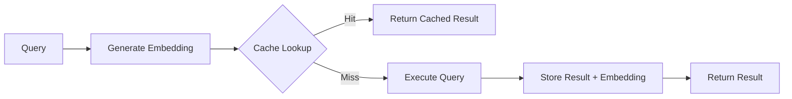

# pg_semantic_cache

!!! info "Welcome to pg_semantic_cache"
    Semantic query result caching for PostgreSQL using vector embeddings - making expensive queries fast through intelligent reuse.

## Overview

pg_semantic_cache is a PostgreSQL extension that implements semantic query result caching using vector embeddings. Unlike traditional query caching that relies on exact string matching, pg_semantic_cache understands the *meaning* of queries through vector similarity, enabling cache hits even when queries are phrased differently.

This extension is particularly valuable for:

- **AI/LLM Applications**: Cache expensive LLM API calls and RAG (Retrieval Augmented Generation) results
- **Analytics Workloads**: Reuse results from complex analytical queries with similar parameters
- **External API Queries**: Cache results from expensive external data sources
- **Database Query Optimization**: Reduce load on expensive database operations

## Key Features

- **Semantic Matching**: Uses pgvector for similarity-based cache lookups
- **Flexible TTL**: Per-entry time-to-live configuration
- **Tag-Based Management**: Organize and invalidate cache entries by tags
- **Multiple Eviction Policies**: LRU, LFU, and TTL-based automatic eviction
- **Cost Tracking**: Monitor and report on query cost savings
- **Configurable Dimensions**: Support for various embedding models (768, 1536, 3072+ dimensions)
- **Multiple Index Types**: IVFFlat (fast) or HNSW (accurate) vector indexes
- **Comprehensive Monitoring**: Built-in statistics, views, and health metrics

## How It Works



1. **Generate Embedding**: Convert your query text into a vector embedding using your preferred model (OpenAI, Cohere, etc.)
2. **Check Cache**: Search for semantically similar cached queries using cosine similarity
3. **Cache Hit**: If a similar query exists above the similarity threshold, return the cached result
4. **Cache Miss**: Execute the actual query, cache the result with its embedding for future use
5. **Automatic Maintenance**: Expired entries are evicted based on TTL and configured policies

## Quick Start

### Prerequisites

- PostgreSQL 14, 15, 16, 17, or 18
- pgvector extension installed
- C compiler (gcc or clang)
- PostgreSQL development headers

### Installation

```bash
# Clone the repository
git clone https://github.com/pgedge/pg_semantic_cache.git
cd pg_semantic_cache

# Build and install
make clean
make
sudo make install
```

### Setup

```sql
-- Install required extensions
CREATE EXTENSION IF NOT EXISTS vector;
CREATE EXTENSION IF NOT EXISTS pg_semantic_cache;

-- Verify installation
SELECT * FROM semantic_cache.cache_health;
```

## Simple Example

```sql
-- Cache a query result with its embedding
SELECT semantic_cache.cache_query(
    query_text := 'What was our Q4 2024 revenue?',
    query_embedding := '[0.123, 0.456, ...]'::text,  -- From your embedding model
    result_data := '{"answer": "Q4 2024 revenue was $2.4M"}'::jsonb,
    ttl_seconds := 1800,  -- 30 minutes
    tags := ARRAY['llm', 'revenue']
);

-- Retrieve with a semantically similar query
SELECT * FROM semantic_cache.get_cached_result(
    query_embedding := '[0.124, 0.455, ...]'::text,  -- Slightly different query
    similarity_threshold := 0.95  -- 95% similarity required
);
```

## Why Use pg_semantic_cache?

### Traditional Caching vs Semantic Caching

| Traditional Cache | Semantic Cache |
|-------------------|----------------|
| "What was Q4 revenue?" ❌ Miss | "What was Q4 revenue?" ✅ Hit |
| "Show Q4 revenue" ❌ Miss | "Show Q4 revenue" ✅ Hit |
| "Q4 revenue please" ❌ Miss | "Q4 revenue please" ✅ Hit |

### Cost Savings Example

For an LLM application making 10,000 queries per day:
- Without caching: $200/day (at $0.02 per query)
- With 80% cache hit rate: $40/day
- **Savings: $160/day or $58,400/year**

## Architecture

pg_semantic_cache is implemented in pure C using the PostgreSQL extension API (PGXS), providing:

- **Small Binary Size**: ~100KB vs 2-5MB for Rust-based extensions
- **Fast Build Times**: 10-30 seconds vs 2-5 minutes
- **Immediate Compatibility**: Works with new PostgreSQL versions immediately
- **Standard Packaging**: Compatible with all PostgreSQL packaging tools

## Performance

- **Lookup Time**: < 5ms for most queries with IVFFlat index
- **Scalability**: Handles 100K+ cached entries efficiently
- **Throughput**: Thousands of cache lookups per second
- **Storage**: Configurable cache size limits with automatic eviction

## Getting Help

- **Documentation**: Browse the sections in the navigation menu
- **Issues**: Report bugs at [GitHub Issues](https://github.com/pgedge/pg_semantic_cache/issues)
- **Examples**: See [Use Cases](use_cases.md) for practical implementations
- **FAQ**: Check the [FAQ](FAQ.md) for common questions

## Next Steps

- [Installation Guide](installation.md) - Detailed installation instructions
- [Configuration](configuration.md) - Configure dimensions, indexes, and policies
- [Functions Reference](functions/index.md) - Complete function documentation
- [Use Cases](use_cases.md) - Practical examples and integration patterns
- [Monitoring](monitoring.md) - Track performance and optimize cache usage

!!! tip "Pro Tip"
    Start with the default IVFFlat index and 1536 dimensions (OpenAI ada-002). You can always reconfigure later with `set_vector_dimension()` and `rebuild_index()`.
